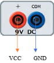

## Procedure
 

Click on **“Click Here”** in Simulation tab.

1.  Click on the **Component** button to place components on the table.

  

&emsp; &emsp; &emsp; ")&emsp; ")&emsp; &emsp;   

**Fig. 1 Components** 
 

2.  Make connections as per the circuit diagram or according to connection table.

  

  

**Fig. 2 Circuit Diagram of Touch Sensor**

**Table 1: Connection table**

 
 

  
3.  Click on **Check Connections** button. If connections are right, click on **'OK'**, then **Simulation** will become active.
4.  Touch the **Sensor** by using mouse pointer and observe its output.
5.  Click on the **Reset** button to reset the page.

