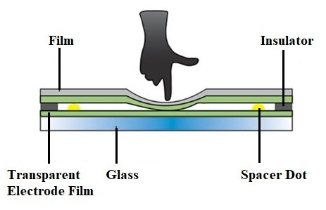
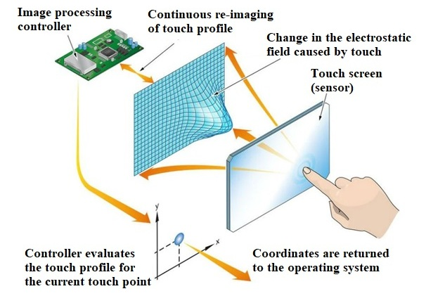

### Introduction

Machines need some sensing elements to interact with their surroundings. This became possible with the invention of sensors. Today we have sensors that can sense motion, light, humidity, temperature, smoke, etc. Sensors have brought a revolutionary change in the size and cost of various control systems. One of such sensors is the Touch sensor.An electronic sensor that is capable enough of capturing and recording the physical touch made by the operator can be defined as a touch sensor.They operate as a switch when touched. Touch sensors offer an intuitive user interface. These are simple to design, low cost and are produced in large scale. With the advance in technology, these sensors are rapidly replacing the mechanical switches.They are used in a wide range of display applications, from smart homes and appliances to security and industrial solutions.Touch sensors, unlike mechanical devices, do not contain moving parts. Hence, they are more durable than mechanical input devices. Touch sensors are robust as there are no openings for humidity and dust to enter.

### **Working principle of Touch Sensor**

Touch sensors are sensitive to any pressure or force applied or touches. The principle of touch is similar to that of a switch. When the switch is closed, the current flows otherwise there is no chance of the current to flow. Similarly, when the touch sensor senses the touch or proximity is captured then it acts like a closed switch otherwise it acts as an open switch. These sensors are also known as ‘Tactile Sensors’. The working principle of touch sensor has been shown in Fig. 1.

**Fig. 1 Working principle of a Touch Sensor** 

### **TYPES OF TOUCH SENSOR**

Based on their functions there are two types of touch sensors- Resistive touch sensor and capacitive touch sensor.

### **RESISTIVE TOUCH SENSOR**

Resistive touch sensor measures touch through responding to the pressure applied to the surface. It consists of two conductive layers and a non-conductive separator. Resistive touch sensors can accommodate non conducting materials like stylus and glove wrapped finger.

#### **How resistive touch sensor work:**

Resistive touch sensors have several layers, where the two main layers are the flexible plastic and glass layer. The front surface has a flexible scratch-resistant plastic with a coating of conductive material (usually Indium Tin Oxide (ITO)) on the underside. The second layer is also coated with ITO and is made of either glass or hard plastic. When a finger (or a stylus) presses down on the flexible plastic, it contacts the second layer and measures the resistance of both the layers at wherever the point of contact was. Fig. 2 shows a diagram on how it works.

  

**Fig.2 Resistive Touch screen and its layers**  

#### **Advantages of a resistive touch sensor**

*   Cost-effective and durable to be used in harsh environments
*   Able to be used with stylus and gloves
*   Less complex
*   Low power consumption

#### **Disadvantages of a resistive touch sensor**

*   The inability for multi-touch technology unlike the capacitive touch sensors
*   Dependent on pressure, require more pressure to be applied for sensing to take place

### **CAPACITIVE TOUCH SENSOR**

Capacitive touch sensor measures touch based on electrical disturbance from a change in capacitance. It consists of an electrode film on top of the glass panel that is conductively coated with a printed circuit pattern around the outer viewing area.

#### **How capacitive touch sensor work:**

In this type of touch sensor, the technology is based on capacitive coupling that detects anything that is conductive or has a dielectric different from air. In this case, the human body (fingers) is being used as an electrical charge conductor. The way it locates where our finger is on the screen is the change of local electrostatic field when our finger touches the glass of the capacitive surface. An image processing controller continuously monitors the electrostatic field (or the movement of each tiny capacitor) to find where exactly the finger touched the screen. Fig. 3 shows a diagram on how it works.  

  

**Fig. 3 Working of Capacitive Touch Sensor** 

#### **Advantages of a capacitive touch sensor**

*   Doesn’t require pressure to be applied since it’s built on the glass itself, hence making force insignificant to sensing requirements
*   Support for multi-touch
*   High responsiveness

#### **Disadvantages of a capacitive touch sensor**

*   Reliability concerns when used in harsh environments
*   Doesn’t work with gloves or stylus

### **WORKING**

A circuit diagram of resistive touch sensor using BJT is shown in Fig. 4. When finger touches the surface, the small resistance of the finger allows some current to flow through it, completing the circuit. The transistor acts as a switch. The resistor of 220 Ω is used to protect the transistor from any possible short circuit of the electrodes. The resistorof 270 Ω is used to restrict the amount of the current to the LED. When both the wires are touched, small current flows through the finger and the transistor switches ON, as a result the load becomes active.

  

**Fig. 4 Circuit diagram of touch sensor circuit using BJT**  

### **Applications of Touch Sensor**

1.  The capacitive touch sensors can be easily manufactured with an attractive design and in less investment. Hence these are widely preferred in mobile phones, iPods, and various industrial and automotive applications. In the measurement of distance, pressure, etc. these sensors are used.
2.  The other type of touch sensors includes resistive. It doesn’t get affected due to small touching sense or contact. It needs a certain amount of force to start operating. So, this type of sensor is utilized in the keypads of musical instruments, touch pads that are resistive, etc.
3.  The most common application of touch sensors can be seen in water taps such that with one touch, the flow of running water can be controlled. These sensors are also utilized in home automation using Arduino or Raspberry pi projects.
4.  A touch sensor is also used in robots, enabling basic movement and the ability to detect touch in its surroundings (E.g. When the robot runs into something, the touch sensor can have it to stop moving).

